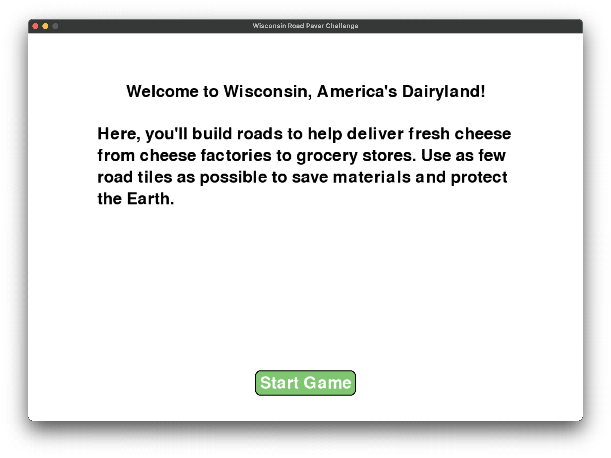
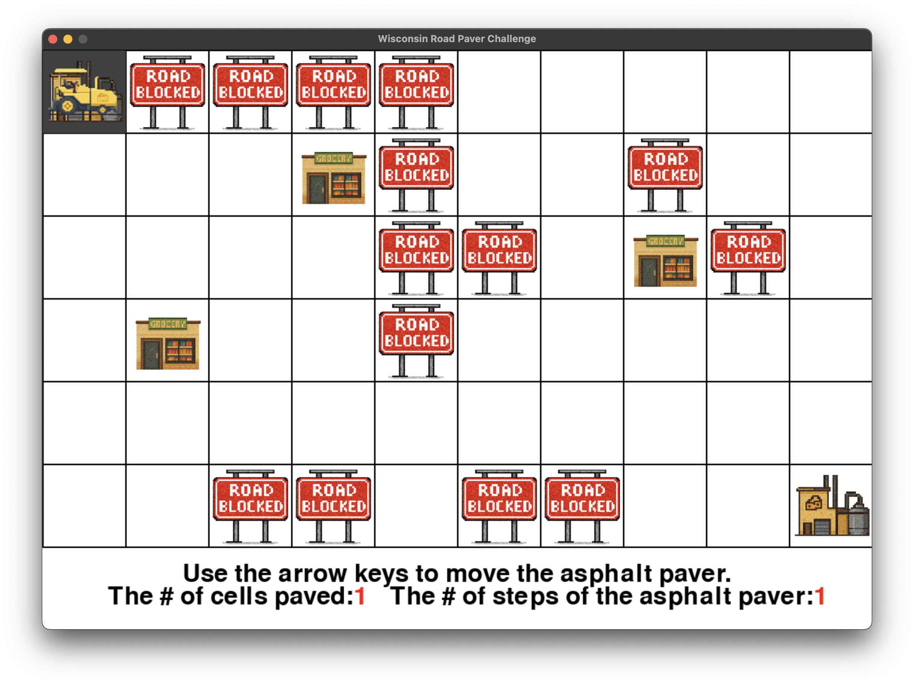
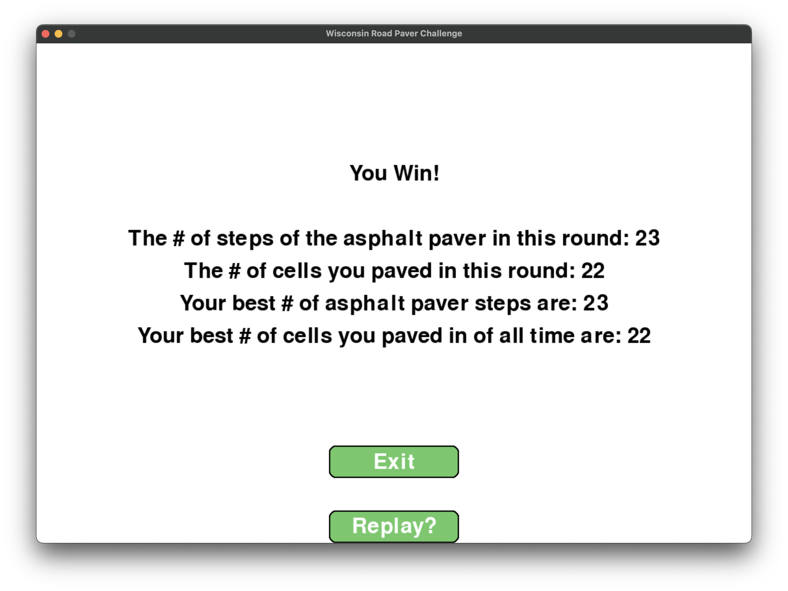

This app makes a game where you drive a asphalt paver and you try to connect dairy factories to grocery stores while trying to pave the lowest amount of cells.

INSTRUCTION VIDEO: https://www.youtube.com/watch?v=1Ql-KZqEAqE

STEP 1: Download and run on python with proper environment installed.

STEP 2: Press the "Start Game" button.

STEP 3: Play the game as shown in the video.

STEP 4: Either choose to quit the game or replay to try for a better score.

